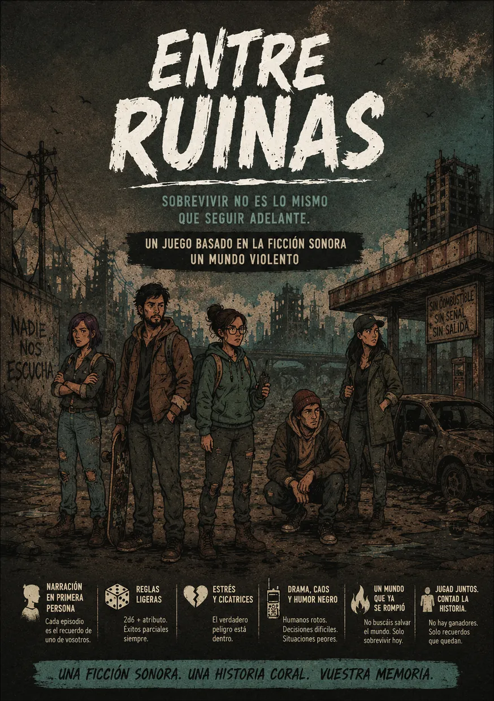

# MR- Entre Ruinas



**Sistema para Foundry VTT de _Entre Ruinas_, el juego de rol narrativo de MIDRA.**
Supervivientes emocionalmente rotos en un mundo que ya no tiene futuro. No hay
director: cada episodio lo cuenta una persona distinta, **la Voz**.

> Sobrevivir no es lo mismo que seguir adelante.

Incluye el **Manual de juego** completo y los suplementos **Un Mundo Violento**
(campaña) y **Refugios**, con fichas, herramientas de mesa, pregenerados y tablas.

<br clear="right">

## Instalar

En Foundry: *Configuración → Sistemas de juego → Instalar sistema* y pega el manifiesto:

```
https://github.com/ManuRomera/mr-entre-ruinas/releases/latest/download/system.json
```

Foundry VTT **13** o **14**. Probado en 13.351; el código que cambia entre versiones está aislado en [`module/compat.mjs`](module/compat.mjs).

## Qué trae

### Ficha de personaje
- **Columna fija** con lo que se usa en cada escena: los cuatro atributos (clic = 2d6 + atributo), el Estrés y las Fichas de Caos.
- **Columna de interpretación**: Marcas (interpretarlas da Caos; se pueden suspender en una escena de refugio), Vínculos con foto (arrastra un personaje para enlazarlo), relaciones iniciales, objeto importante, pregunta incómoda (su respuesta solo la ve quien lleva el personaje hasta que decide sacarla a la luz) y diario.
- **Modo compacto** de una columna para tenerla abierta junto al lienzo, **candado** para atributos, retrato y borrados, y diseño que se adapta a cualquier ancho de ventana.
- **Asistente de creación** con los seis pasos del manual, los ejemplos del libro como sugerencias y el reparto +2, +1, +1, 0 validado en vivo.

### Tiradas y consecuencias
- Tarjeta de resultado con los dados: **10+** éxito limpio, **7–9** éxito con coste (la Voz elige la consecuencia con un clic), **6 o menos** fallo con los Movimientos Duros a mano y 1 Estrés automático (desactivable).
- **Ayudo a mi Vínculo Positivo**: +1 en la siguiente tirada.
- **Crisis** guiada al llenar el Estrés: cómo explota el personaje y su nueva Marca permanente.
- **Fichas de Caos**: ganar con motivo; gastar en detalle (1), flashback (1), giro (2) o alterar la escena (3).

### Refugio, comunidades y PNJ
- **Refugio** (suplemento Refugios): Seguridad, Suministros, Moral, Ruido y Confianza siempre a la vista, con aviso al llegar a su umbral; Estrés colectivo con Crisis, Movimiento de comunidad y Marca; qué lo mantiene vivo (si se pierde, Crisis inmediata); relojes de amenaza; roles; expediciones.
- Suministros a 0: al empezar cada episodio, todos ganan 1 Estrés.
- **Comunidades** definidas por lo que necesitan, temen, sacrifican y ocultan. **PNJ** con los estados de violencia de Un Mundo Violento.
- Con la opción *Mesa sin director* (activa por defecto), refugios, comunidades y PNJ pertenecen a toda la mesa y las fichas de personaje son visibles para todos.

### Panel de la Voz
- Temporada y episodio, quién es la Voz y las cinco fases (Cold Open, escenas rápidas, escalada, punto de ruptura, cliffhanger).
- **Corte de escena**, **escena de refugio** (cada personaje elige su recuperación desde su ficha) y **fin de episodio** (cliffhanger, Marcas recuperadas, contador de temporada y relevo de la Voz entre quienes aún no lo han sido).
- Preparación con ejemplos del libro, los tres escenarios de Un Mundo Violento, las consecuencias y todos los oráculos de los tres libros.
- Cualquier jugador puede abrirlo y usarlo: la Voz rota. Los cambios compartidos los aplica el GM conectado.

### Compendios
- **Manual y suplementos**: los tres libros completos como diarios, más una guía de uso del sistema.
- **Supervivientes pregenerados**: Luz, Gabo, Marta e Iván, con retrato, token y objeto.
- **Tablas de la Voz**: 37 tablas aleatorias en tres carpetas (Manual, Un Mundo Violento, Refugios).

### Memoria de ventanas
Todas las ventanas del sistema recuerdan, por usuario y mundo, su **posición**, su **tamaño** (uno para el modo normal y otro para el compacto), la **pestaña** activa, las **secciones plegadas** y el **desplazamiento**. Una ficha nueva hereda el último tamaño usado. Si otra persona provoca un repintado mientras escribes, tu texto sin guardar, el foco y el cursor se conservan. Para empezar de cero: *Configuración → Memoria de ventanas → Olvidar posiciones*.

## Macros

```js
game.mrEntreRuinas.abrirVoz();                    // Panel de la Voz
game.mrEntreRuinas.episodio.corte();              // Corte de escena
game.mrEntreRuinas.episodio.abrirEscenaRefugio(); // Escena de refugio
game.mrEntreRuinas.oraculo("rumores");            // Un rumor al azar
actor.tirar("coco", { vinculo: true });           // Tirada con +1 por ayudar al Vínculo Positivo
game.mrEntreRuinas.diagnostico();                 // Versión, generación y API de chat en uso
```

## Desarrollo

```bash
npm ci
npm test          # reglas (node --test)
npm run check     # sintaxis, JSON y rutas de recursos
npm run build     # compila _data/ y module/listas.mjs a packs/ (con Foundry cerrado)
```

- `module/listas.mjs` es la única fuente de las tablas del libro: la usan las fichas, el Panel de la Voz y el compilador de compendios.
- `_data/manual.json` se genera desde los PDF con `scripts/manual-desde-pdf.py` (los PDF no están en el repositorio).
- Publicar: sube la versión en `system.json` y `package.json`, añade la entrada en `CHANGELOG.md` y empuja la etiqueta `vX.Y.Z`; el flujo de GitHub Actions compila y crea la release.

## Créditos y derechos

**Entre Ruinas**, **Un Mundo Violento** y **Refugios** —textos, ambientación, personajes y arte— son obra de **MIDRA · Midespinas & Amdra** y se incluyen con su permiso.
Implementación para Foundry VTT: **Manu Romera**. El código es MIT (ver [LICENSE](LICENSE)); las tipografías Oswald, Barlow Semi Condensed y Caveat, SIL OFL 1.1.
